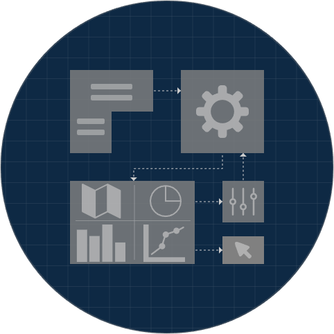

# VA-Blueprint: Uncovering Building Blocks for Visual Analytics System Design

 

*A structured, machine-readable knowledge base of components and dependencies found in Visual Analytics (VA) systems, derived systematically from research literature.*

---

**Main page:** [https://urbantk.org/va-blueprint](https://urbantk.org/va-blueprint) 

**Interactive interface:** [https://leovsferreira.github.io/va-building-blocks/](https://leovsferreira.github.io/va-building-blocks/) 

---

## Overview 

Building Visual Analytics (VA) systems is a complex, iterative process involving the integration of data processing, analytics, and visualization. Despite the growing number of VA systems, their underlying components and architectures are often loosely documented, making reuse, extension, and systematic design challenging. 

**VA-Blueprint** addresses this gap by providing a structured methodology and a resulting knowledge base to systematically identify, categorize, and organize the fundamental building blocks of VA systems. This project: 

1.  **Curated a Corpus:** Started with 101 research papers describing VA systems, focusing initially on the domain of Urban Visual Analytics. 
2.  **Defined a Structure:** Developed a multi-level hierarchical schema (Blueprint) to represent VA system components and their dependencies (data flow, interactions). 
3.  **Extracted Components:** Employed a combination of manual analysis and LLM-assisted extraction to populate the knowledge base with components from the 101 systems. 
4.  **Created a Knowledge Base:** Produced a machine-readable repository of 101 system blueprints in JSON format, detailing over 2500 components and 2400 dependencies. 
5.  **Developed an Interface:** Built an interactive web-based tool to visually explore the structure and components of individual system blueprints. 

The goal is to provide a practical foundation for more structured, reproducible, and efficient VA system design and development. 

## Key Concepts: The Blueprint Structure 

Each VA system in the knowledge base is represented as a hierarchical JSON structure, following the VA-Blueprint schema: 

1.  **High Blocks:** Represent the major stages in a typical VA workflow. 
    *   Examples: `Data Loading`, `Data Processing`, `Visualization`, `Interaction`. 
2.  **Intermediate Blocks:** Group components within High Blocks based on more specific functions or types. 
    *   Examples: `Loader` (under Data Loading), `Rasterization`, `Aggregation` (under Data Processing), `Geospatial`, `Infovis` (under Visualization), `Filter` (under Interaction). 
3.  **Granular Blocks:** Represent the most specific, identifiable components – the concrete building blocks. 
    *   Examples: `Map 2D`, `Line Chart`, `Area Selection`, `k-Means Clustering`, `Trajectory Data`. 
    *   Each Granular Block includes details like its name, unique ID, description, inputs, outputs, source paper citation quote, and downstream dependencies (`FeedsInto`). 
4.  **Dependencies:** Edges (implicitly defined by `Inputs`, `Outputs`, `FeedsInto`, and interaction types) capture relationships between blocks, representing either data flow or control flow (user interactions). 

## Repository Contents 

*   `/knowledge-base`: Contains the 101 individual VA system blueprints as JSON files. Each file represents one system analyzed in the study. 
*   `LICENSE`: VA-Blueprint is MIT Licensed. Free for both commercial and research use. 

## Using the Knowledge Base 

### 1. Direct Access (JSON Files) 

You can directly browse, parse, and analyze the JSON files located in the `/knowledge-base` directory. These files are machine-readable and contain the full structured information for each VA system. This is suitable for computational analysis, comparison, or integration into other tools. 

### 2. Interactive Visual Interface 

An interactive web-based interface is available to explore the blueprints visually: 

**Link:** [https://leovsferreira.github.io/va-building-blocks/](https://leovsferreira.github.io/va-building-blocks/) 

**How to Use:** 

*   Navigate to the interface link. 
*   **Load a Blueprint:** 
    *   **Option A (Upload):** On the lateral menu, click the "Select JSON File" button and select a JSON file from the `/knowledge-base` directory of this repository (after downloading it). 
    *   **Option B (Copy/Paste):** Open a JSON file from the `/knowledge-base` directory, copy its entire content, and paste it into the text area provided in the interface on the lateral menu. Then click "Load JSON". 
*   **Explore:** The interface will render the system's architecture as a node-link diagram. 
    *   Nodes represent Granular Blocks, spatially organized by Intermediate and High Blocks. 
    *   Edges show dependencies (data=solid, interaction=dashed). 
    *   Hover over nodes/edges to highlight connections. 
    *   Click on a node to see its detailed information (description, inputs, outputs, citation) in a tooltip. 

## Research Paper 

*Under Review* 

## Team 

*   **Leonardo Ferreira** (UIC) 
*   **Gustavo Moreira** (UIC) 
*   **[Fabio Miranda](https://fmiranda.me/)** (UIC) 
